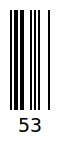
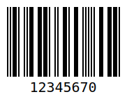
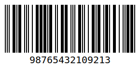

<p align="center">
	
	<br><br>
	<a href="https://packagist.org/packages/antwerpes/barcodes-1d"></a>
	<a href="https://github.com/antwerpes/barcodes-1d/actions?query=workflow%3Alint+branch%3Amaster"></a>
	<a href="https://packagist.org/packages/antwerpes/barcodes-1d"></a>
	<a href="https://github.com/antwerpes/barcodes-1d/blob/master/LICENSE.md"></a>
</p>

# Barcodes 1D

Barcode generator written in PHP for encoding and rendering most common barcode formats to multiple image output formats.

## Features

- Supports most common barcode formats (Code128, EAN, UPC, ...)
- Can render to SVG, PNG, JPG or WEBP using GD
- Images (PNG/JPG/WEBP) may be configured to scale up to any size
- Supports common customization requirements (size, color, text display, font size, background color, font for image rendering, or format-specific options such as guard bars or quiet zones)

## Supported barcodes
| Format                  | Variations                     |
| ----------------------- | ------------------------------ |
| Code 128                | Auto-Mode and forced A/B/C     |
| EAN                     | EAN-2 / EAN-5 / EAN-8 / EAN-13 |
| UPC                     | UPC-A / UPC-E                  |
| MSI                     | Mod10, Mod11, Mod1010, Mod1110 |
| Codabar                 |                                |
| Code 11                 |                                |
| Code 2 of 5             |                                |
| Code 2 of 5 Interleaved |                                |
| Code 39                 |                                |
| Code 93                 |                                |
| ITF-14                  |                                |
| Pharmacode              |                                |

## Installation

Install the package via composer:

```bash
composer require antwerpes/barcodes-1d
```

## Usage

Use the `Barcodes` factory class to create an encoder and render its output to SVG or a base64-encoded image:

```php
use Antwerpes\Barcodes\Barcodes;
use Antwerpes\Barcodes\Enumerators\Format;

// SVG
$svg = Barcodes::create('12345678', Format::CODE_128);
file_put_contents('img.svg', $svg);

// Or as an image
$image = Barcodes::create('12345678', Format::CODE_128, 'png');
file_put_contents('img.png', base64_decode($image));

// Example for scaled up (4x) WEBP
$image = Barcodes::create('12345678', Format::CODE_128, 'webp', [
    'image_scale' => 4,
]);
file_put_contents('img.webp', base64_decode($image));
```

### Customization

Check out the [options](#options) for an overview of all customization options.

## Examples
#### Code 128

```php
Barcodes::create('A12345', Format::CODE_128);
```
#### EAN-13
  
```php
Barcodes::create('5901234123457', Format::EAN_13);
Barcodes::create('5901234123457', Format::EAN_13, 'svg', ['flat' => true]);
Barcodes::create('5901234123457', Format::EAN_13, 'svg', ['with_quiet_zone' => true]);
```
#### EAN-2 / EAN-5 / EAN-8
  
```php
Barcodes::create('53', Format::EAN_2);
Barcodes::create('52495', Format::EAN_5);
Barcodes::create('96385074', Format::EAN_8);
```
#### UPC-A / UPC-E
 
```php
Barcodes::create('123456789999', Format::UPC_A);
Barcodes::create('01245714', Format::UPC_E);
// These also work and will produce the same result
Barcodes::create('124571', Format::UPC_E);
Barcodes::create('01210000457', Format::UPC_E);
Barcodes::create('012100004574', Format::UPC_E);
```
#### Codabar

```php
Barcodes::create('A12345B', Format::CODABAR);
```
#### Code 11

```php
Barcodes::create('01234-5678', Format::CODE_11);
```
#### Code 2 of 5 / Code 2 of 5 Interleaved / ITF-14
  
```php
Barcodes::create('1234567', Format::CODE_25);
Barcodes::create('12345670', Format::CODE_25_INTERLEAVED);
Barcodes::create('98765432109213', Format::ITF_14);
```
#### Code 39 / Code 93
 
```php
Barcodes::create('AB12', Format::CODE_39);
Barcodes::create('TEST93', Format::CODE_93);
```
#### MSI

```php
Barcodes::create('8052', Format::MSI);
```
#### Pharmacode

```php
Barcodes::create('1234', Format::PHARMACODE);
```

## Options

Generic options for all barcode formats:

| Option          | Default          | Type          | Comment                                                      |
| --------------- | ---------------- | ------------- | ------------------------------------------------------------ |
| `width`         | `2`              | `int`         | Width of a single bar                                        |
| `height`        | `100`            | `int`         | Height of a regular bar                                      |
| `text_margin`   | `2`              | `int`         | Distance between barcode and text                            |
| `text_align`    | `center`         | `string`      | `left` / `center` / `right`                                  |
| `background`    | `#ffffff`        | `string\|null` | Background color. Use `null` for transparent background      |
| `color`         | `#000000`        | `string`      | Color of the barcode and text                                |
| `text_color`    | –                | `string`      | Text color. Falls back to `color` if not set                 |
| `margin`        | `10`             | `int`         | Margin on all sides of the barcode                           |
| `margin_top`    | –                | `int`         | Falls back to `margin` if not set                            |
| `margin_right`  | –                | `int`         | Falls back to `margin` if not set                            |
| `margin_bottom` | –                | `int`         | Falls back to `margin` if not set                            |
| `margin_left`   | –                | `int`         | Falls back to `margin` if not set                            |
| `display_value` | `true`           | `bool`        | Should the code text be displayed below the barcode?         |
| `font_size`     | `20`             | `int`         | Large font sizes may break the layout                        |
| `image_font`    | `JetBrains Mono` | `string`      | Path to custom font TTF for image rendering (not used for SVG). |
| `image_scale` | `1` | `int` | Sets the final image scale, e.g. 2x or 4x (not used for SVG). |

There are additional options for some barcode formats:

**Code128**

| Option | Default | Type     | Comment                                                      |
| ------ | ------- | -------- | ------------------------------------------------------------ |
| `mode` | `AUTO`  | `string` | Encoding mode (`AUTO` / `A`/ `B`/ `C`). Use `AUTO` for most efficient encoding. |

**EAN-8 / EAN-13 / UPC-A / UPC-E**

| Option            | Default | Type   | Comment                                                      |
| ----------------- | ------- | ------ | ------------------------------------------------------------ |
| `flat`            | `false` | `bool` | Flat encoding (without the guard bars)                       |
| `with_quiet_zone` | `false` | `bool` | Enables quiet zones with (`<` and/or `>` symbols). Only relevant for EAN-8 / EAN-13 |

**Code39**

| Option            | Default | Type   | Comment                             |
| ----------------- | ------- | ------ | ----------------------------------- |
| `enable_checksum` | `false` | `bool` | Calculate and append mod43 checksum |
| `full_ascii`      | `false` | `bool` | Enable full ASCII mode              |

**Code39**

| Option       | Default | Type   | Comment                |
| ------------ | ------- | ------ | ---------------------- |
| `full_ascii` | `false` | `bool` | Enable full ASCII mode |

**MSI**

| Option        | Default | Type           | Comment                                       |
| ------------- | ------- | -------------- | --------------------------------------------- |
| `check_digit` | `null`  | `string\|null` | `MOD_10` / `MOD_11` / `MOD_1010` / `MOD_1110` |

## Changelog

Please see [CHANGELOG](CHANGELOG.md) for more information on what has changed recently.

## Contributing

Please see [CONTRIBUTING](.github/CONTRIBUTING.md) for details.

## License

The MIT License (MIT). Please see [License File](LICENSE.md) for more information.

## Acknowledgements

- [lindell/JsBarcode](https://github.com/lindell/JsBarcode)
- [barnhill/barcodelib](https://github.com/barnhill/barcodelib)
